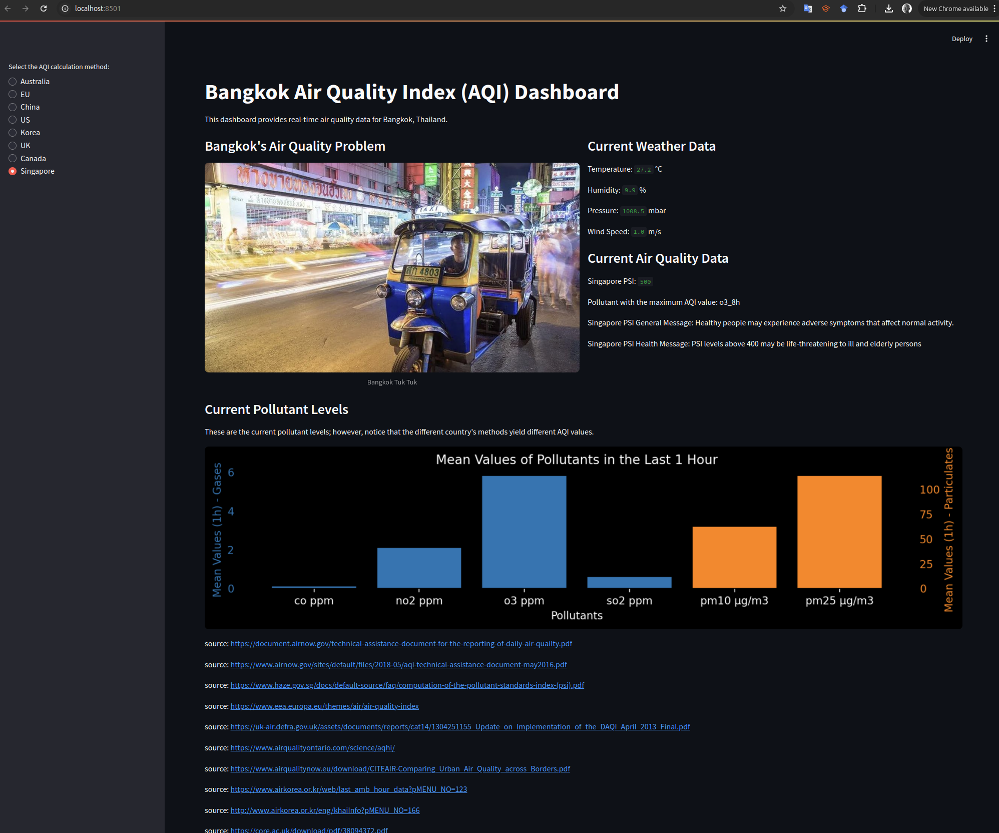

# Project Title
## My package
This is my experimental docker version

This is a project to create an app that does stuff.  The stuff that it does is to access an air quality API periodically.  When the airquality is bad, e.g. in the unhealthy range, it sends an alert to the user.  The user can then take action to protect their health.    

There are a number of different approaches to calculating an air quality index.  Different countries have different formulas for doing so.  The dashboard for this project willl compare the different formulas and show the results of several different approaches.  The notification program will use the US EPA formula to determine the air quality index.

Note that the AQI is a number that is used to communicate how polluted the air is.  The higher the number, the more polluted the air is.  The AQI is calculated based on the concentration of pollutants in the air.  The pollutants that are used to calculate the AQI are: PM2.5, PM10, O3, NO2, SO2, and CO.  The AQI is calculated based on the concentration of these pollutants in the air.  In many places on the interweb you will see the PM2.5 value reported as the AQI.  PM25 is a measure of a certain size of particulate. However, sometimes it is not the particulates that are the problem.  Sometimes it is the gases that are the problem.  Thus, a properly calculated AQI will take into account all of the pollutants.  

One of the surprising things about this project is that there does not seem to be a standard way to calculate the AQI.  Many countries have their own algorithms.  However, on the internet you often see the PM25 values serving as the AQI.  Done properly, AQI uses at least five values. CO, NO2, O3, SO2, PM10, and PM25.  The AQI is calculated based on the concentration of these pollutants.  Some countries, such as India, also include Pb and NH3. Other countries, such as Canada, omit CO and SO2.  

AQI can be thought of as a running average.  The length of the running average varies considerably between countries.  Hong Kong and Canada use a 3 hour interval.  The US uses 24 hours for particulates and 8 hours and 1 hour for gases.  For the UK, the interval can be as short as 15 minutes.

## Author(s)
Philip Fowler

# Usage
## Instructions on how to use this project.
You will need an WAQI API key from https://aqicn.org/api/ to use this project  

You will need to create a .env based on the .env example template.  You will need to add your WAQI API key to the .env file.  

## Installation
To install Docker, follow these steps:

1. **Install Docker Desktop:**
    - **Windows and macOS:**
      - Download Docker Desktop from [Docker's official website](https://www.docker.com/products/docker-desktop).
      - Follow the installation instructions provided on the website.
    - **Linux:**
      - Follow the instructions for your specific distribution on the [Docker Engine installation page](https://docs.docker.com/engine/install/).

2. **Verify Docker Installation:**
    - Open a terminal or command prompt.
    - Run the following command to verify that Docker is installed correctly:
      ```bash
      docker --version
      ```

To install the Docker extension for Visual Studio Code, follow these steps:

1. **Open Visual Studio Code:**
    - Launch Visual Studio Code on your computer.

2. **Install the Docker Extension:**
    - Go to the Extensions view by clicking on the Extensions icon in the Activity Bar on the side of the window or by pressing `Ctrl+Shift+X`.
    - In the Extensions view, search for "Docker".
    - Click on the "Install" button next to the Docker extension by Microsoft.

3. **Verify the Extension Installation:**
    - Once installed, you should see a Docker icon in the Activity Bar.
    - Click on the Docker icon to open the Docker view and verify that the extension is working correctly.

You are now ready to use Docker and the Docker extension in Visual Studio Code.


## To create the Docker container from the Dockerfile, you can use the following commands:

```bash
docker build -t bkk-aqi .

docker run --env-file .env bkk-aqi
```

You should end up with a dashboard that looks like this:



